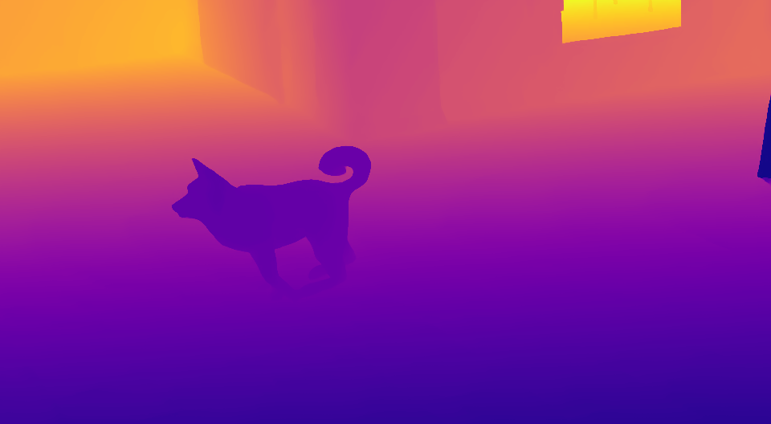
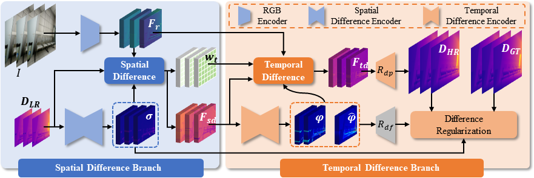
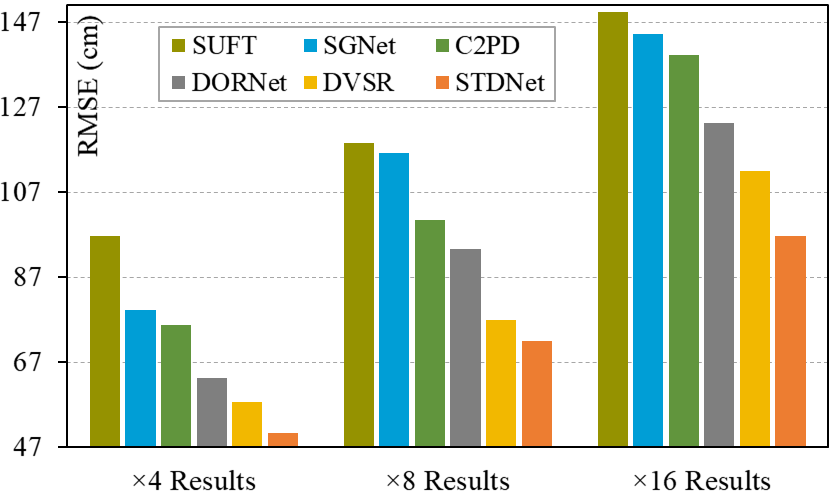

<h2 align="center"> SpatioTemporal Difference Network for Video Depth Super-Resolution (AAAI 2026 Oral) </h2>

<p align="center">
  <a href="https://arxiv.org/pdf/2508.01259">
    
  </a>
</p>

<p align="center"><a href="https://scholar.google.com/citations?user=VogTuQkAAAAJ&hl=zh-CN">Zhengxue Wang</a><sup>1</sup>, 
<a href="https://scholar.google.com.hk/citations?user=VoIgY38AAAAJ&hl=zh-CN">Yuan Wu</a><sup>1</sup>,
<a href="https://implus.github.io/">Xiang Li</a><sup>2</sup>,
  <a href="https://yanzq95.github.io/">Zhiqiang Yan✉</a><sup>3</sup>, 
<a href="https://scholar.google.com/citations?user=6CIDtZQAAAAJ&hl=zh-CN">Jian Yang✉</a><sup>1</sup>  <!--&Dagger;-->
</p>

<p align="center">
  <sup>✉</sup>Corresponding author&nbsp;&nbsp;&nbsp;<br>
  <sup>1</sup>Nanjing University of Science and Technology&nbsp;&nbsp;&nbsp;
  <br>
  <sup>2</sup>Nankai University&nbsp;&nbsp;&nbsp;
  <sup>3</sup>National University of Singapore&nbsp;&nbsp;&nbsp;
</p>

## 🎬 Video demo
<div align="center">
<table>
  <tr>
    <td align="center">
      
      <br>
      LR
    </td>
    <td align="center">
      
      <br>
      C2PD
    </td>
    <td align="center">
      
      <br>
      DORNet
    </td>
  </tr>
  <tr>
    <td align="center">
      
      <br>
      RGB
    </td>
    <td align="center">
      
      <br>
      <strong>Ours</strong>
    </td>
    <td align="center">
      
      <br>
      GT
    </td>
  </tr>
</table>
</div>

## :mega: Pipeline

<p align="center">

</p>

Overview of STDNet. Given $\boldsymbol D_{LR}$, we first predict its spatial difference representation $\boldsymbol \sigma$. Then, $\boldsymbol D_{LR}$, $\boldsymbol I$, and $\boldsymbol \sigma$ are jointly fed into the spatial difference to enhance non-smooth regions, producing $\boldsymbol F_{sd}$. Next, we estimate the temporal difference representations for consecutive frames and cross frames, generating $\boldsymbol \varphi$ and $\widehat{\boldsymbol \varphi}$. These difference representations are used to propagate adjacent RGB and depth frames to the current depth frame, generating HR depth video $\boldsymbol D_{HR}$. Finally, a degradation regularization takes $\boldsymbol D_{HR}$, $\boldsymbol D_{GT}$, $\boldsymbol \sigma$, $\boldsymbol \varphi$, and $\widehat{\boldsymbol \varphi}$ as inputs to optimize the learning of spatiotemporal difference representations.

## :hammer: Dependencies

Please refer to ``'env.yaml'``.

## 💾 Models
All pretrained models can be found <a href="https://drive.google.com/drive/folders/14MsOiHI2xIJ9w07hI-xrsX_1fHvoAAhq?usp=sharing">here</a>.

## 📥Datasets
All datasets can be downloaded from the following link:

[TarTanAir](https://github.com/castacks/tartanair_tools)

[DyDToF](https://github.com/facebookresearch/DVSR/)

[DynamicReplica](https://dynamic-stereo.github.io/)

Additionally, we provide a DyDToF test subset in the ``'dataset'`` folder for quick implementation, with the corresponding index file is ``'data/dydtof_list/school_shot8_subset.txt'``.

## 🏋️ Training

```
cd STDNet
mkdir -p experiment/SRDNet_$scale$/MAE_best

python -m torch.distributed.launch --nproc_per_node 2 train.py --scale 4 --result_root 'experiment/SRDNet_$scale$' --result_root_MAE 'experiment/SRDNet_$scale$/MAE_best'
```

## ⚡Testing

```
### TarTanAir dataset
python test_TarTanAir.py --scale 4
### DyDToF dataset
python test_DyDToF.py --scale 4
### DyDToF dataset
python test_DynamicReplica.py --scale 4
```

## 📊Experiments

<p align="center">

<br>
Quantitative comparisons between our STDNet and previous state-of-the-art methods on TarTanAir dataset.
</p>

## 📝 Citation

If our method proves to be of any assistance, please consider citing:
```
@article{wang2025spatiotemporal,
  title={SpatioTemporal Difference Network for Video Depth Super-Resolution},
  author={Wang, Zhengxue and Wu, Yuan and Li, Xiang and Yan, Zhiqiang and Yang, Jian},
  journal={arXiv preprint arXiv:2508.01259},
  year={2025}
}
```
